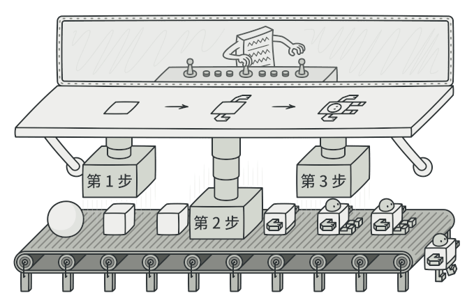

Builder是一种创建型模式，使得能够分步骤创建复杂对象，该模式允许你使用相同的创建代码生成不同类型和形式的对象。

### 问题

假设有这样一个复杂对象， 在对其进行构造时需要对诸多成员变量和嵌套对象进行繁复的初始化工作。 这些初始化代码通常深藏于一个包含众多参数且让人基本看不懂的构造函数中； 甚至还有更糟糕的情况， 那就是这些代码散落在客户端代码的多个位置。

例如， 我们来思考如何创建一个 `房屋`House对象。 建造一栋简单的房屋， 首先你需要建造四面墙和地板， 安装房门和一套窗户， 然后再建造一个屋顶。 但是如果你想要一栋更宽敞更明亮的房屋， 还要有院子和其他设施 （例如暖气、 排水和供电设备）， 那又该怎么办呢？

最简单的方法是扩展 `房屋`基类， 然后创建一系列涵盖所有参数组合的子类。 但最终你将面对相当数量的子类。 任何新增的参数 （例如门廊类型） 都会让这个层次结构更加复杂。

另一种方法则无需生成子类。 你可以在 `房屋`基类中创建一个包括所有可能参数的超级构造函数， 并用它来控制房屋对象。 这种方法确实可以避免生成子类， 但它却会造成另外一个问题。

### 解决方案

builder模式建议将对象构造代码从产品类中抽取出来，放在一个名为builder的独立对象中。

该模式将对象构造过程划分为一组步骤，比如创建墙壁、地板、房门，每次创建对象时，你都通过builder对象执行一系列步骤。重点是你无需调用所有步骤，只需要调用创建特定对象配置所需要的那些步骤即可。

**主管（Director）**

你可以进一步将用于创建产品的一系列生成器步骤调用抽取成为单独的*主管*类。 主管类可定义创建步骤的执行顺序， 而生成器则提供这些步骤的实现。

但是并不一定需要主管类，客户端可以直接以特定顺序调用创建步骤。不过主管类中非常适合放入各种特定构造流程，便于在程序中反复使用。

此外， 对于客户端代码来说， 主管类完全隐藏了产品构造细节。 客户端只需要将一个生成器与主管类关联， 然后使用主管类来构造产品， 就能从生成器处获得构造结果了。