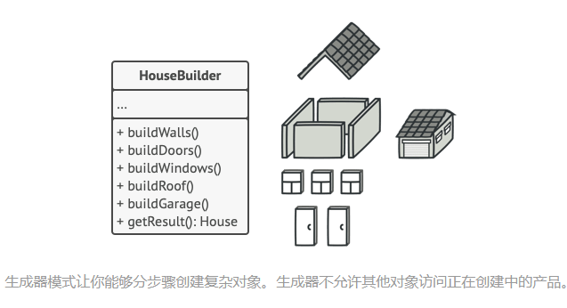

Builder是一种创建型模式，使得能够分步骤创建复杂对象，该模式允许你使用相同的创建代码生成不同类型和形式的对象。


### 问题

​		假设有这样一个复杂对象， 在对其进行构造时需要对诸多成员变量和嵌套对象进行繁复的初始化工作。 这些初始化代码通常深藏于一个包含众多参数且让人基本看不懂的构造函数中； 甚至还有更糟糕的情况， 那就是这些代码散落在客户端代码的多个位置。


​		例如， 我们来思考如何创建一个 `房屋`House对象。 建造一栋简单的房屋， 首先你需要建造四面墙和地板， 安装房门和一套窗户， 然后再建造一个屋顶。 但是如果你想要一栋更宽敞更明亮的房屋， 还要有院子和其他设施 （例如暖气、 排水和供电设备）， 那又该怎么办呢？

​		最简单的方法是扩展 `房屋`基类， 然后创建一系列涵盖所有参数组合的子类。 但最终你将面对相当数量的子类。 任何新增的参数 （例如门廊类型） 都会让这个层次结构更加复杂。

​		另一种方法则无需生成子类。 你可以在 `房屋`基类中创建一个包括所有可能参数的超级构造函数， 并用它来控制房屋对象。 这种方法确实可以避免生成子类， 但它却会造成另外一个问题。


### 解决方案

builder模式建议**将对象构造代码从产品类中抽取出来，放在一个名为builder的独立对象中**。



​		该模式将对象构造过程划分为一组步骤，比如创建墙壁、地板、房门，每次创建对象时，你都通过builder对象执行一系列步骤。重点是你无需调用所有步骤，只需要调用创建特定对象配置所需要的那些步骤即可。

**主管（Director）**


​		你可以进一步将用于创建产品的一系列生成器步骤调用抽取成为单独的*主管*类。 主管类可定义创建步骤的执行顺序， 而生成器则提供这些步骤的实现。

​		但是并不一定需要主管类，客户端可以直接以特定顺序调用创建步骤。不过主管类中非常适合放入各种特定构造流程，便于在程序中反复使用。

​		此外， 对于客户端代码来说， 主管类完全隐藏了产品构造细节。 客户端只需要将一个生成器与主管类关联， 然后使用主管类来构造产品， 就能从生成器处获得构造结果了。


### 结构


​		汽车是一个复杂对象， 有数百种不同的制造方法。 我们没有在 `汽车`类中塞入一个巨型构造函数， 而是将汽车组装代码抽取到单独的汽车生成器类中。 该类中有一组方法可用来配置汽车的各种部件。

​		如果客户端代码需要组装一辆与众不同、 精心调教的汽车， 它可以直接调用生成器。 或者， 客户端可以将组装工作委托给主管类， 因为主管类知道如何使用生成器制造最受欢迎的几种型号汽车。


### 应用场景

- **使用Builder可避免重叠构造函数的出现。**

生成器模式让你可以分步骤生成对象， 而且允许你仅使用必须的步骤。 应用该模式后， 你再也不需要将几十个参数塞进构造函数里了。

- **当你希望使用代码创建不同形式的产品时。**

如果你需要创建的各种形式的产品， 它们的制造过程相似且仅有细节上的差异， 此时可使用生成器模式。

基本生成器接口中定义了所有可能的制造步骤， 具体生成器将实现这些步骤来制造特定形式的产品。 同时， 主管类将负责管理制造步骤的顺序。

- **使用Bulider构造组合树或其他复杂对象。**

生成器模式让你能分步骤构造产品。 你可以延迟执行某些步骤而不会影响最终产品。 你甚至可以递归调用这些步骤， 这在创建对象树时非常方便。

生成器在执行制造步骤时， 不能对外发布未完成的产品。 这可以避免客户端代码获取到不完整结果对象的情况。


### 实现方法

1. 清晰地定义通用步骤， 确保它们可以制造所有形式的产品。 否则你将无法进一步实施该模式。

2. 在基本生成器接口中声明这些步骤。

3. 为每个形式的产品创建具体生成器类， 并实现其构造步骤。

   不要忘记实现获取构造结果对象的方法。 你不能在生成器接口中声明该方法， 因为不同生成器构造的产品可能没有公共接口， 因此你就不知道该方法返回的对象类型。 但是， 如果所有产品都位于单一类层次中， 你就可以安全地在基本接口中添加获取生成对象的方法。

4. 考虑创建主管类。 它可以使用同一生成器对象来封装多种构造产品的方式。

5. 客户端代码会同时创建生成器和主管对象。 构造开始前， 客户端必须将生成器对象传递给主管对象。 通常情况下， 客户端只需调用主管类构造函数一次即可。 主管类使用生成器对象完成后续所有制造任务。 还有另一种方式， 那就是客户端可以将生成器对象直接传递给主管类的制造方法。

6. 只有在所有产品都遵循相同接口的情况下， 构造结果可以直接通过主管类获取。 否则， 客户端应当通过生成器获取构造结果。


### 与其他模式的关系

- 在许多设计工作的初期都会使用[工厂方法模式](https://refactoringguru.cn/design-patterns/factory-method) （较为简单， 而且可以更方便地通过子类进行定制）， 随后演化为使用[抽象工厂模式](https://refactoringguru.cn/design-patterns/abstract-factory)、 [原型模式](https://refactoringguru.cn/design-patterns/prototype)或[生成器模式](https://refactoringguru.cn/design-patterns/builder) （更灵活但更加复杂）。
- **[生成器](https://refactoringguru.cn/design-patterns/builder)重点关注如何分步生成复杂对象。 [抽象工厂](https://refactoringguru.cn/design-patterns/abstract-factory)专门用于生产一系列相关对象。** *抽象工厂*会马上返回产品， *生成器*则允许你在获取产品前执行一些额外构造步骤。
- 你可以在创建复杂[组合模式](https://refactoringguru.cn/design-patterns/composite)树时使用[生成器](https://refactoringguru.cn/design-patterns/builder)， 因为这可使其构造步骤以递归的方式运行。
- 你可以结合使用[生成器](https://refactoringguru.cn/design-patterns/builder)和[桥接模式](https://refactoringguru.cn/design-patterns/bridge)： *主管*类负责抽象工作， 各种不同的*生成器*负责*实现*工作。
- [抽象工厂](https://refactoringguru.cn/design-patterns/abstract-factory)、 [生成器](https://refactoringguru.cn/design-patterns/builder)和[原型](https://refactoringguru.cn/design-patterns/prototype)都可以用[单例模式](https://refactoringguru.cn/design-patterns/singleton)来实现。


### 代码示例

**在C++中使用Builder**

**使用示例：** 生成器模式是 C++ 世界中的一个著名模式。 当你需要创建一个可能有许多配置选项的对象时， 该模式会特别有用。

```c++
/**
 * It makes sense to use the Builder pattern only when your products are quite
 * complex and require extensive configuration.
 *
 * Unlike in other creational patterns, different concrete builders can produce
 * unrelated products. In other words, results of various builders may not
 * always follow the same interface.
 */
class Product1
{
    public:
    std::vector<std::string> parts_;
    void ListParts()const
    {
        std::cout << "Product parts: ";
        for (size_t i=0;i<parts_.size();i++)
        {
            if(parts_[i]== parts_.back())
            {
                std::cout << parts_[i];
            }else
            {
                std::cout << parts_[i] << ", ";
            }
        }
        std::cout << "\n\n"; 
    }
};

/**
 * The Builder interface specifies methods for creating the different parts of
 * the Product objects.
 */
class Builder{
    public:
    virtual ~Builder(){}
    virtual void ProducePartA() const =0;
    virtual void ProducePartB() const =0;
    virtual void ProducePartC() const =0;
};
/**
 * The Concrete Builder classes follow the Builder interface and provide
 * specific implementations of the building steps. Your program may have several
 * variations of Builders, implemented differently.
 */
class ConcreteBuilder1 : public Builder{
    private:

    Product1* product;

    /**
     * A fresh builder instance should contain a blank product object, which is
     * used in further assembly.
     */
    public:

    ConcreteBuilder1(){
        this->Reset();
    }

    ~ConcreteBuilder1(){
        delete product;
    }

    void Reset(){
        this->product= new Product1();
    }
    /**
     * All production steps work with the same product instance.
     */

    void ProducePartA()const override{
        this->product->parts_.push_back("PartA1");
    }

    void ProducePartB()const override{
        this->product->parts_.push_back("PartB1");
    }

    void ProducePartC()const override{
        this->product->parts_.push_back("PartC1");
    }

    /**
     * Concrete Builders are supposed to provide their own methods for
     * retrieving results. That's because various types of builders may create
     * entirely different products that don't follow the same interface.
     * Therefore, such methods cannot be declared in the base Builder interface
     * (at least in a statically typed programming language). Note that PHP is a
     * dynamically typed language and this method CAN be in the base interface.
     * However, we won't declare it there for the sake of clarity.
     *
     * Usually, after returning the end result to the client, a builder instance
     * is expected to be ready to start producing another product. That's why
     * it's a usual practice to call the reset method at the end of the
     * `getProduct` method body. However, this behavior is not mandatory, and
     * you can make your builders wait for an explicit reset call from the
     * client code before disposing of the previous result.
     */

    /**
     * Please be careful here with the memory ownership. Once you call
     * GetProduct the user of this function is responsable to release this
     * memory. Here could be a better option to use smart pointers to avoid
     * memory leaks
     */

    Product1* GetProduct() {
        Product1* result= this->product;
        this->Reset();
        return result;
    }
};

/**
 * The Director is only responsible for executing the building steps in a
 * particular sequence. It is helpful when producing products according to a
 * specific order or configuration. Strictly speaking, the Director class is
 * optional, since the client can control builders directly.
 */
class Director{
    /**
     * @var Builder
     */
    private:
    Builder* builder;
    /**
     * The Director works with any builder instance that the client code passes
     * to it. This way, the client code may alter the final type of the newly
     * assembled product.
     */

    public:

    void set_builder(Builder* builder){
        this->builder=builder;
    }

    /**
     * The Director can construct several product variations using the same
     * building steps.
     */

    void BuildMinimalViableProduct(){
        this->builder->ProducePartA();
    }
    
    void BuildFullFeaturedProduct(){
        this->builder->ProducePartA();
        this->builder->ProducePartB();
        this->builder->ProducePartC();
    }
};
/**
 * The client code creates a builder object, passes it to the director and then
 * initiates the construction process. The end result is retrieved from the
 * builder object.
 */
/**
 * I used raw pointers for simplicity however you may prefer to use smart
 * pointers here
 */
void ClientCode(Director& director)
{
    ConcreteBuilder1* builder = new ConcreteBuilder1();
    director.set_builder(builder);
    std::cout << "Standard basic product:\n"; 
    director.BuildMinimalViableProduct();
    
    Product1* p= builder->GetProduct();
    p->ListParts();
    delete p;

    std::cout << "Standard full featured product:\n"; 
    director.BuildFullFeaturedProduct();

    p= builder->GetProduct();
    p->ListParts();
    delete p;

    // Remember, the Builder pattern can be used without a Director class.
    std::cout << "Custom product:\n";
    builder->ProducePartA();
    builder->ProducePartC();
    p=builder->GetProduct();
    p->ListParts();
    delete p;

    delete builder;
}

int main(){
    Director* director= new Director();
    ClientCode(*director);
    delete director;
    return 0;    
}
```

