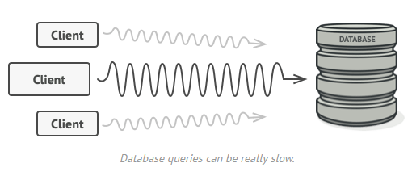
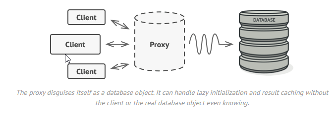
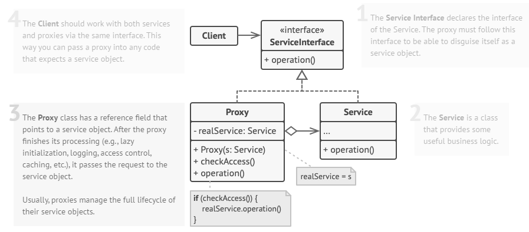

### 什么是代理模式？

代理是一种结构设计模式，允许您为另一个对象提供替代或占位符。代理控制对原始对象的访问，允许您在请求到达原始对象之前或之后执行某些操作。


### 为什么要使用代理模式？

为什么要控制对对象的访问?下面是一个例子:您有一个消耗大量系统资源的大型对象。你有时需要它，但不是总是。




### 解决什么问题

代理模式建议您创建一个具有与原始服务对象相同接口的新代理类。然后更新应用程序，以便它将代理对象传递给所有原始对象的客户端。在接收到来自客户端的请求后，代理创建一个真实的服务对象，并将所有工作委托给它。



您可以实现惰性初始化:仅在实际需要时创建该对象。所有对象的客户端都需要执行一些延迟的初始化代码。不幸的是，这可能会导致大量代码重复。

在理想情况下，我们希望将此代码直接放入对象的类中，但这并不总是可能的。例如，类可能是一个封闭的第三方库的一部分。


### 应用实例

1. windows的快捷方式
2. 信用卡可以代替现金支付
3. 在代售点买车票而不一定要去车站


### 结构




### 实现方式

1. 如果没有现成的服务接口， 你就需要创建一个接口来实现代理和服务对象的可交换性。从服务类中抽取接口并非总是可行的，因为你需要对服务的所有客户端进行修改，让它们使用接口。备选计划是将代理作为服务类的子类，这样代理就能继承服务的所有接口了。
2. 创建代理类，其中**必须包含一个存储指向服务的引用的成员变量**。通常情况下，代理负责创建服务并对其整个生命周期进行管理。在一些特殊情况下，客户端会通过构造函数将服务传递给代理。
3. 根据需求实现代理方法。在大部分情况下**代理在完成一些任务后应将工作委派给服务对象**。
4. 可以考虑新建一个构建方法来判断客户端可获取的是代理还是实际服务。你可以在代理类中创建一个简单的静态方法，也可以创建一个完整的工厂方法。
5. 可以考虑为服务对象实现延迟初始化。


### Proxy in C++

​		**代理是一种结构设计模式，它提供一个对象，作为客户使用的实际服务对象的替代品。代理接收客户端请求，完成一些工作(访问控制、缓存等)，然后将请求传递给服务对象。**

​		代理对象具有与服务相同的接口，这使得它在传递给客户端时可以与实际对象互换。（里氏替换原则）

```c++
#include <iostream>
/**
 * The Subject interface declares common operations for both RealSubject and the
 * Proxy. As long as the client works with RealSubject using this interface,
 * you'll be able to pass it a proxy instead of a real subject.
 */
class Subject 
{
	public:
  		virtual void Request() const = 0;
};
/**
 * The RealSubject contains some core business logic. Usually, RealSubjects are
 * capable of doing some useful work which may also be very slow or sensitive -
 * e.g. correcting input data. A Proxy can solve these issues without any
 * changes to the RealSubject's code.
 */
class RealSubject : public Subject 
{
	public:
  		void Request() const override 
        {
    		std::cout << "RealSubject: Handling request.\n";
  		}
};
/**
 * The Proxy has an interface identical to the RealSubject.
 */
class Proxy : public Subject 
{
   /**
   * @var RealSubject
   */
	private:
    	RealSubject *real_subject_;

     	bool CheckAccess() const 
        {
    		// Some real checks should go here.
    		std::cout << "Proxy: Checking access prior to firing a real request.\n";
    		return true;
  		}
    
        void LogAccess() const 
        {	
            std::cout << "Proxy: Logging the time of request.\n";
        }
    
   /**
   * The Proxy maintains a reference to an object of the RealSubject class. It
   * can be either lazy-loaded or passed to the Proxy by the client.
   */
 		public:
  		Proxy(RealSubject *real_subject) : real_subject_(new RealSubject(*real_subject)) {}

  		~Proxy() 
        {
    		delete real_subject_;
  		}
  /**
   * The most common applications of the Proxy pattern are lazy loading,
   * caching, controlling the access, logging, etc. A Proxy can perform one of
   * these things and then, depending on the result, pass the execution to the
   * same method in a linked RealSubject object.
   */
        void Request() const override 
        {
            if (this->CheckAccess()) 
            {
              this->real_subject_->Request();
              this->LogAccess();
            }
        }
};
/**
 * The client code is supposed to work with all objects (both subjects and
 * proxies) via the Subject interface in order to support both real subjects and
 * proxies. In real life, however, clients mostly work with their real subjects
 * directly. In this case, to implement the pattern more easily, you can extend
 * your proxy from the real subject's class.
 */
void ClientCode(const Subject &subject) 
{
  	// ...
  	subject.Request();
  	// ...
}

int main() 
{
    std::cout << "Client: Executing the client code with a real subject:\n";
    RealSubject *real_subject = new RealSubject;
    ClientCode(*real_subject);
    std::cout << "\n";
    std::cout << "Client: Executing the same client code with a proxy:\n";
    Proxy *proxy = new Proxy(real_subject);
    ClientCode(*proxy);

    delete real_subject;
    delete proxy;
    return 0;
}

//Out:
Client: Executing the client code with a real subject:
RealSubject: Handling request.

Client: Executing the same client code with a proxy:
Proxy: Checking access prior to firing a real request.
RealSubject: Handling request.
Proxy: Logging the time of request.
```


### **Reference**

https://refactoring.guru/design-patterns/proxy

https://zhuanlan.zhihu.com/p/305600490

