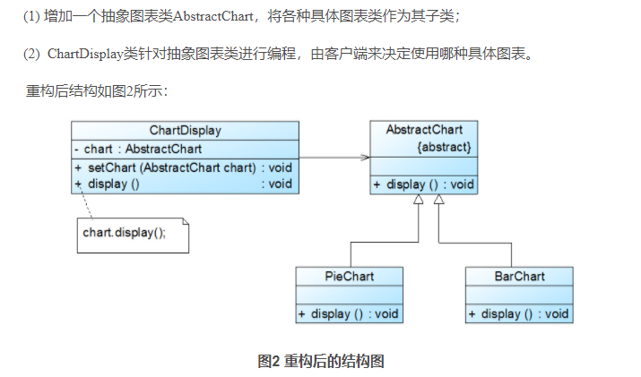

## 设计模式
设计模式是一套被反复使用的、多数人知晓的、经过分类编目的、代码设计经验的总结。使用设计模式是为了重用代码、让代码更容易被他人理解、保证代码可靠性。

**GOF（四人帮，全拼 Gang of Four）**。他们所提出的设计模式主要是基于以下的面向对象设计原则。

- 对接口编程而不是对实现编程。
- 优先使用对象组合而不是继承。

| 序号 | 模式 & 描述                                                  | 包括                                                         |
| :--- | :----------------------------------------------------------- | :----------------------------------------------------------- |
| 1    | **创建型模式** 这些设计模式提供了一种在创建对象的同时隐藏创建逻辑的方式，而不是使用 new 运算符直接实例化对象。这使得程序在判断针对某个给定实例需要创建哪些对象时更加灵活。 | 工厂模式（Factory Pattern）抽象工厂模式（Abstract Factory Pattern）单例模式（Singleton Pattern）建造者模式（Builder Pattern）原型模式（Prototype Pattern） |
| 2    | **结构型模式** 这些设计模式关注类和对象的组合。继承的概念被用来组合接口和定义组合对象获得新功能的方式。 | 适配器模式（Adapter Pattern）桥接模式（Bridge Pattern）过滤器模式（Filter、Criteria Pattern）组合模式（Composite Pattern）装饰器模式（Decorator Pattern）外观模式（Facade Pattern）享元模式（Flyweight Pattern）代理模式（Proxy Pattern） |
| 3    | **行为型模式** 这些设计模式特别关注对象之间的通信。          | 责任链模式（Chain of Responsibility Pattern）命令模式（Command Pattern）解释器模式（Interpreter Pattern）迭代器模式（Iterator Pattern）中介者模式（Mediator Pattern）备忘录模式（Memento Pattern）观察者模式（Observer Pattern）状态模式（State Pattern）空对象模式（Null Object Pattern）策略模式（Strategy Pattern）模板模式（Template Pattern）访问者模式（Visitor Pattern） |
| 4    | **J2EE 模式** 这些设计模式特别关注表示层。这些模式是由 Sun Java Center 鉴定的。 | MVC 模式（MVC Pattern）业务代表模式（Business Delegate Pattern）组合实体模式（Composite Entity Pattern）数据访问对象模式（Data Access Object Pattern）前端控制器模式（Front Controller Pattern）拦截过滤器模式（Intercepting Filter Pattern）服务定位器模式（Service Locator Pattern）传输对象模式（Transfer Object Pattern） |

### 面向对象设计六大原则

#### 单一职责原则（Single Responsibility Principle）

单一职责原则的定义是：应该有且仅有一个原因引起类的变更。

单一职责原则不仅适用于接口和类，也适用于方法。一个方法尽可能只做一件事。

#### 开闭原则（Open Closed Principle）

https://blog.csdn.net/lovelion/article/details/7537584

开闭原则是指一个软件实体如类、模块和函数应该对**扩展**开放，对**修改**关闭。软件实体应尽量在不修改原有代码的情况下进行扩展。

软件实体可以指一个软件模块，一个由多个类组成的局部结构或一个独立的类。

**抽象化**是开闭原则的关键——Q：什么是抽象呢？

例：

新加一个图表就要新加if条件判断逻辑。

重构：

#### 里氏替换原则（Liskov Substitution Principle）
