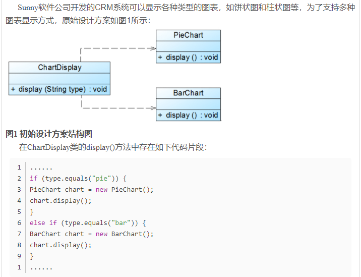

## 设计模式
设计模式是一套被反复使用的、多数人知晓的、经过分类编目的、代码设计经验的总结。使用设计模式是为了重用代码、让代码更容易被他人理解、保证代码可靠性。

**GOF（四人帮，全拼 Gang of Four）**。他们所提出的设计模式主要是基于以下的面向对象设计原则。

- 对接口编程而不是对实现编程。
- 优先使用对象组合而不是继承。

| 序号 | 模式 & 描述                                                  | 包括                                                         |
| :--- | :----------------------------------------------------------- | :----------------------------------------------------------- |
| 1    | **创建型模式** 这些设计模式提供了一种在创建对象的同时隐藏创建逻辑的方式，而不是使用 new 运算符直接实例化对象。这使得程序在判断针对某个给定实例需要创建哪些对象时更加灵活。 | 工厂模式（Factory Pattern）抽象工厂模式（Abstract Factory Pattern）单例模式（Singleton Pattern）建造者模式（Builder Pattern）原型模式（Prototype Pattern） |
| 2    | **结构型模式** 这些设计模式关注类和对象的组合。继承的概念被用来组合接口和定义组合对象获得新功能的方式。 | 适配器模式（Adapter Pattern）桥接模式（Bridge Pattern）过滤器模式（Filter、Criteria Pattern）组合模式（Composite Pattern）装饰器模式（Decorator Pattern）外观模式（Facade Pattern）享元模式（Flyweight Pattern）代理模式（Proxy Pattern） |
| 3    | **行为型模式** 这些设计模式特别关注对象之间的通信。          | 责任链模式（Chain of Responsibility Pattern）命令模式（Command Pattern）解释器模式（Interpreter Pattern）迭代器模式（Iterator Pattern）中介者模式（Mediator Pattern）备忘录模式（Memento Pattern）观察者模式（Observer Pattern）状态模式（State Pattern）空对象模式（Null Object Pattern）策略模式（Strategy Pattern）模板模式（Template Pattern）访问者模式（Visitor Pattern） |
| 4    | **J2EE 模式** 这些设计模式特别关注表示层。这些模式是由 Sun Java Center 鉴定的。 | MVC 模式（MVC Pattern）业务代表模式（Business Delegate Pattern）组合实体模式（Composite Entity Pattern）数据访问对象模式（Data Access Object Pattern）前端控制器模式（Front Controller Pattern）拦截过滤器模式（Intercepting Filter Pattern）服务定位器模式（Service Locator Pattern）传输对象模式（Transfer Object Pattern） |

### 面向对象设计六大原则

#### 单一职责原则（Single Responsibility Principle）

单一职责原则的定义是：应该有且仅有一个原因引起类的变更。

单一职责原则不仅适用于接口和类，也适用于方法。一个方法尽可能只做一件事。

#### 开闭原则（Open Closed Principle）

https://blog.csdn.net/lovelion/article/details/7537584

开闭原则是指一个软件实体如类、模块和函数应该对**扩展**开放，对**修改**关闭。软件实体应尽量在不修改原有代码的情况下进行扩展。

软件实体可以指一个软件模块，一个由多个类组成的局部结构或一个独立的类。

**抽象化**是开闭原则的关键——Q：什么是抽象呢？

例：

新加一个图表就要新加if条件判断逻辑。

重构：

#### 里氏替换原则（Liskov Substitution Principle）

所有引用基类的地方必须能够透明的使用其子类的对象。

继承的优缺点

优点：

代码共享，减少创建类的工作量，每个子类都拥有父类的方法和属性；提高代码的重用性；子类可以形似父类，但又异于父类；提高代码的可扩展性，实现父类的方法就可以“为所欲为”了;提高产品或项目的开放性。

缺点：

继承是侵入性的，只要继承，就必须拥有父类的所有属性和方法；降低代码的灵活性，子类必须拥有父类的属性和方法；

增强了耦合性，当父类的常量、变量和方法被修改时，必需要考虑子类的修改，而且在缺乏规范的环境下，这种修改可能带来非常糟糕的结果；大片的代码需要重构。

​		里氏替换原则告诉我们，在软件中将基类对象替换成它的子类对象，程序不会产生任何错误和异常，反过来不成立，如果一个地方使用的是一个子类对象的话，不一定能够使用它的基类对象。如：我喜欢动物，那我喜欢🐱，因为🐱是动物的子类；但是我喜欢🐱，不能说我喜欢动物，因为我不喜欢🐕。

​		里氏替换原则是实现开闭原则的重要方式之一，在传递参数时使用基类对象，除此以外，在定义成员变量、定义局部变量、确定返回类型的时候都可以使用里氏替换原则。

#### 依赖倒置原则（Dependence Inversion Principle）

高层模块不应依赖底层模块，两者都应依赖其抽象；抽象不应该依赖其细节，细节应该依赖抽象。

核心思想是：要面向接口编程，不要面向实现编程。

​		依赖倒置原则要求我们在代码中传递参数时或者在关联关系中，尽量使用层次高的抽象层类，即使用接口和抽象类进行变量类型声明、参数类型声明、方法返回类型声明、以及数据类型转换等，而不要使用具体类来做这些事情。

​		为了确保该原则的应用，一个具体类应当只实现接口或抽象类中声明过的方法，而不要给出多余的方法，否则无法调用到子类的新方法。

实现方法：

- 每个类尽量提供接口或者抽象类，或者两者都具备
- 变量的声明类型尽量是接口或者抽象类
- 任何类都不应该从具体类派生
- 使用继承时尽量遵循里氏替换原则

#### 接口隔离原则（Interface Segregation Principle）

使用多个专门的接口，而不使用单一的总接口，即客户端不应该依赖那些它不需要的接口。

​		根据接口隔离原则，当一个接口太大时，我们需要将它分割成一些更细小的接口，使用该接口的客户端仅需知道与之相关的方法即可。每一个接口应该承担一种相对独立的角色，不做不需要的事。

#### 迪米特法则（law of Demeter）

一个软件实体应当尽可能少地与其他实体发生相互作用。

​		迪米特法则要求我们在设计系统时，应该尽量减少对象之间的交互，如果两个对象之间不必彼此直接通信，那么这两个对象就不应该发生任何直接的相互作用，如果其中的一个对象需要调用另一个对象的某个方法的话，可以通过第三者转发这个调用。简而言之，就是通过引入一个合理的第三者来降低现有对象之间的耦合度。

​		在将迪米特法则运用到系统设计中时，要注意：在类的划分上，应当尽量创建松耦合的类，类之间的耦合度越低，就越有利于复用，一个处在松耦合中的类一旦被修改，不会对关联的类造成太大波及；